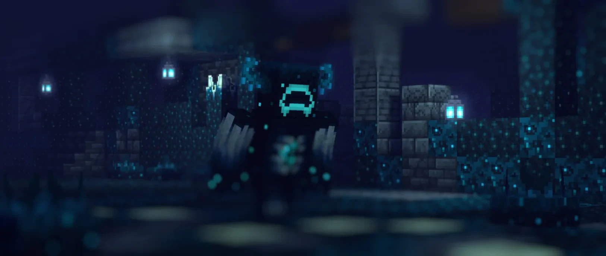

<h1 align="center">NotSkrib</h1>

  

  
  

---

### 👋 About

Self-taught developer building **thread-safe Paper/Folia plugins**, **packet-level detectors**, **screenshare anti-cheat**, and the **Discord bots** that tie servers together. Everything here runs on live servers.

### 🛠️ Stack

### 🚀 Featured work

| Project | What it is |
| --- | --- |
| **ErrorSMP plugin suite** | 13 Paper/Folia plugins: staff moderation GUIs, packet-level anti-cheat, Discord sync, PvP tuning |
| **SSAC** | Multi-tenant screenshare anti-cheat SaaS: 17-module .NET forensic scanner + Supabase-backed staff panel |
| **FrostFFACore** | 63-class FFA engine: kit editor, combat tagging, arena block ledger |
| **Microwave FFA Mace** | Single-authority rotating Mace with hourly event rotations |

### 📂 Open source

- [**error-pc-check**](https://github.com/NotSkrib/error-pc-check) — consensual Minecraft screenshare / forensic anti-cheat tool
- [**ErrorSMP-OrbitalStrike**](https://github.com/NotSkrib/ErrorSMP-OrbitalStrike) — Paper plugin with single-use Nuke and Stab rods
- [**ModDetector**](https://github.com/NotSkrib/ModDetector) — detects client mods via the sign/anvil translation-key side-channel

### 📫 Get in touch

Plugin work, questions, or just want to talk servers — message me on [Discord (@notskrib)](https://discord.com/users/795965474411249664).
